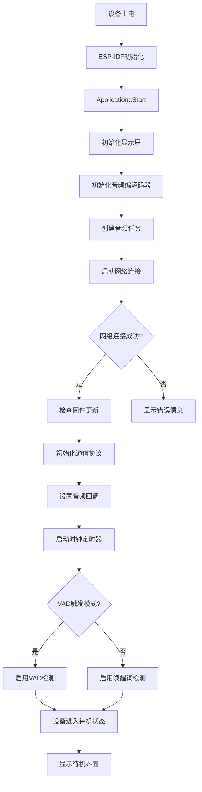
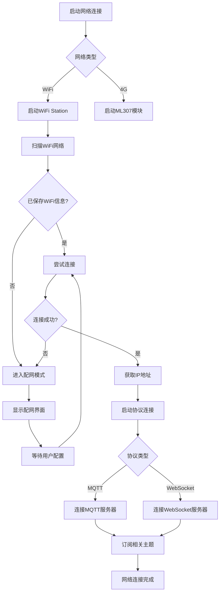
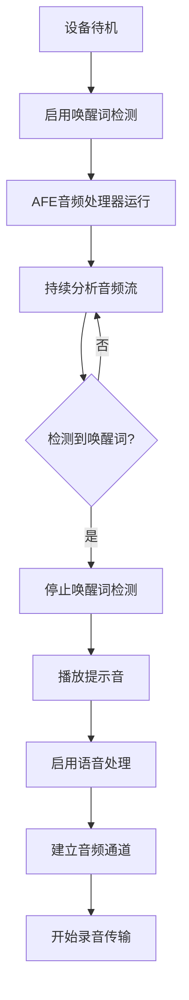
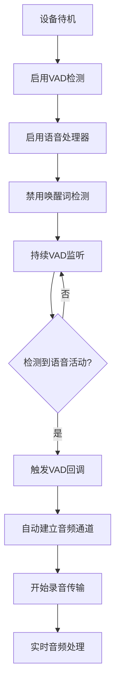
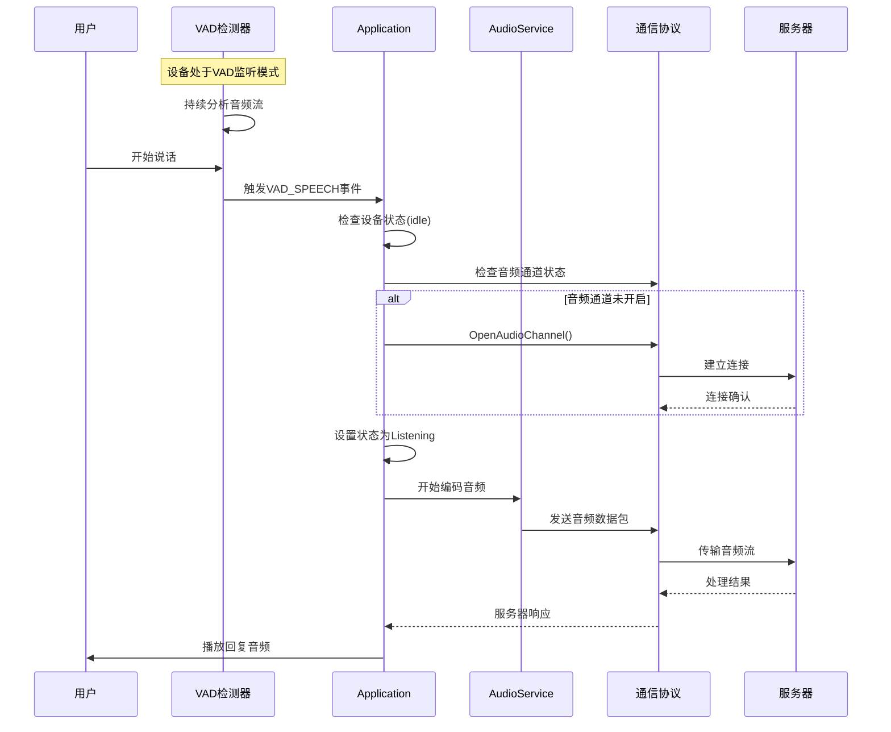
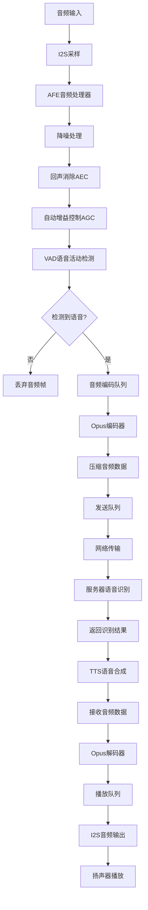
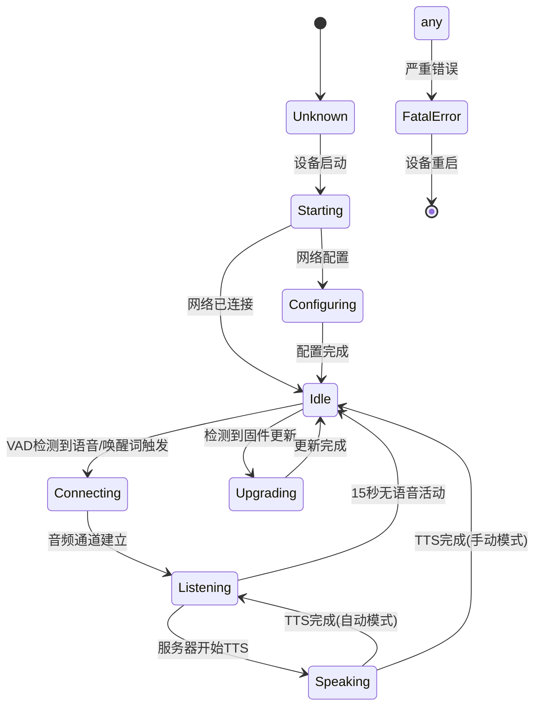

# ESP32-S3 小智AI设备工作流程文档

本文档详细描述了ESP32-S3小智AI设备从启动、连接到音频处理的完整工作流程。

## 📋 目录

1. [设备启动流程](#设备启动流程)
2. [网络连接流程](#网络连接流程)
3. [音频处理模式](#音频处理模式)
4. [VAD触发录音流程](#vad触发录音流程)
5. [语音处理流程](#语音处理流程)
6. [状态机转换](#状态机转换)
7. [关键组件说明](#关键组件说明)

---

## 设备启动流程



### 启动阶段关键步骤

1. **系统初始化**：
   - ESP-IDF核心组件初始化
   - 事件循环创建
   - NVS闪存初始化

2. **音频系统初始化**：
   ```cpp
   // 创建3个核心音频任务
   - 音频输入任务 (优先级8)
   - 音频输出任务 (优先级3) 
   - Opus编解码任务 (优先级2)
   ```

3. **配置检查**：
   ```cpp
   #ifdef CONFIG_VAD_TRIGGER_RECORDING
       vad_trigger_recording_ = true;
   #else
       vad_trigger_recording_ = false;
   #endif
   ```

---

## 网络连接流程



### 网络连接关键代码

```cpp
// WiFi连接回调
board.StartNetwork();

// 协议初始化
if (use_mqtt) {
    protocol_ = std::make_unique<MqttProtocol>();
} else {
    protocol_ = std::make_unique<WebsocketProtocol>();
}

bool protocol_started = protocol_->Start();
```

---

## 音频处理模式

### 传统唤醒词模式



### VAD触发录音模式（新功能）



### 模式对比

| 特性 | 唤醒词模式 | VAD触发模式 |
|------|------------|-------------|
| 激活方式 | 特定唤醒词 | 任何语音 |
| 响应速度 | 较慢 | 更快 |
| 功耗 | 较低 | 中等 |
| 误触发 | 较少 | 可能较多 |
| 用户体验 | 需记忆唤醒词 | 自然对话 |

---

## VAD触发录音流程



### VAD检测核心代码

```cpp
// VAD状态变化回调
callbacks.on_vad_change = [this](bool speaking) {
    xEventGroupSetBits(event_group_, MAIN_EVENT_VAD_CHANGE);
    
    // VAD触发录音模式下的自动处理
    if (vad_trigger_recording_ && speaking && device_state_ == kDeviceStateIdle) {
        Schedule([this]() {
            OnVadDetected();  // 自动触发录音
        });
    }
};

// VAD检测触发处理
void Application::OnVadDetected() {
    if (device_state_ == kDeviceStateIdle) {
        ESP_LOGI(TAG, "VAD detected, starting recording");
        
        if (!protocol_->IsAudioChannelOpened()) {
            SetDeviceState(kDeviceStateConnecting);
            if (!protocol_->OpenAudioChannel()) {
                return;
            }
        }
        
        SetListeningMode(kListeningModeAutoStop);
    }
}
```

---

## 语音处理流程



### 音频数据流架构

```
输入流程:
MIC → [AFE处理器] → {编码队列} → [Opus编码器] → {发送队列} → 服务器

输出流程:
服务器 → {解码队列} → [Opus解码器] → {播放队列} → 扬声器
```

### 关键音频参数

```cpp
// Opus编码器配置
- 采样率: 16kHz
- 声道数: 单声道
- 帧长度: 60ms
- 比特率: 自适应

// AFE处理器配置
- VAD模式: VAD_MODE_0 (正常模式)
- 降噪: 启用神经网络降噪
- AEC: 根据配置启用设备端或服务器端
- AGC: 自动增益控制
```

---

## 状态机转换



### 状态说明

| 状态 | 描述 | 触发条件 |
|------|------|----------|
| `Unknown` | 未知状态 | 设备启动时 |
| `Starting` | 启动中 | 系统初始化 |
| `Configuring` | 配置中 | 网络配置或WiFi配网 |
| `Idle` | 待机状态 | 网络连接完成，等待激活 |
| `Connecting` | 连接中 | 建立音频通道 |
| `Listening` | 监听中 | 录音并发送音频数据 |
| `Speaking` | 播放中 | 播放服务器返回的音频 |
| `Upgrading` | 升级中 | OTA固件更新 |
| `FatalError` | 致命错误 | 系统错误，需要重启 |

---

## 关键组件说明

### 1. AudioService 音频服务

```cpp
class AudioService {
    // 核心功能
    void EnableWakeWordDetection(bool enable);    // 唤醒词检测控制
    void EnableVoiceProcessing(bool enable);      // 语音处理控制
    void SetCallbacks(const Callbacks& callbacks); // 设置回调函数
    
    // 任务线程
    void AudioInputTask();      // 音频输入处理任务
    void AudioOutputTask();     // 音频输出处理任务
    void OpusEncodingTask();    // Opus编解码任务
};
```

### 2. AFE音频处理器

```cpp
class AfeAudioProcessor {
    // VAD检测
    bool IsVadSpeech(const afe_iface_res_t* res);
    
    // 音频处理链
    - 降噪 (Neural Network)
    - 回声消除 (AEC)
    - 自动增益控制 (AGC)
    - 语音活动检测 (VAD)
};
```

### 3. 协议通信层

```cpp
class Protocol {
    virtual bool OpenAudioChannel() = 0;     // 打开音频通道
    virtual void SendAudioPacket() = 0;      // 发送音频数据
    virtual void SendWakeWordDetected() = 0; // 发送唤醒词事件
    virtual bool IsAudioChannelOpened() = 0; // 检查通道状态
};
```

### 4. 设备配置

```cpp
// 编译时配置选项
CONFIG_VAD_TRIGGER_RECORDING=y     // 启用VAD触发录音
CONFIG_USE_AFE_WAKE_WORD=y         // 启用AFE唤醒词检测
CONFIG_USE_AUDIO_PROCESSOR=y       // 启用音频处理器
CONFIG_USE_DEVICE_AEC=y            // 启用设备端AEC
```

---

## 性能优化

### 功耗管理

```cpp
// 智能功耗控制
void PowerSaveTimer::PowerSaveCheck() {
    if (seconds_to_sleep_ != -1 && ticks_ >= seconds_to_sleep_) {
        // 15秒无活动后关闭音频输入/输出
        codec->EnableInput(false);
        
        // 启用Light Sleep模式
        esp_pm_config_t pm_config = {
            .max_freq_mhz = cpu_max_freq_,
            .min_freq_mhz = 40,             // 降至40MHz
            .light_sleep_enable = true,
        };
        esp_pm_configure(&pm_config);
    }
}
```

### 内存管理

- **PSRAM利用**：大型音频缓冲区存储在外部PSRAM
- **队列管理**：音频队列使用循环缓冲区减少内存分配
- **模型缓存**：AI模型存储在专用分区，按需加载

### 实时性保证

- **任务优先级**：音频输入任务最高优先级(8)
- **中断处理**：I2S DMA中断最小化延迟
- **队列深度**：平衡延迟和稳定性

---

## 故障排除

### 常见问题

1. **VAD误触发**：
   - 调整VAD阈值
   - 检查环境噪音水平
   - 优化降噪参数

2. **音频延迟**：
   - 检查网络连接质量
   - 调整音频队列深度
   - 优化Opus编码参数

3. **连接断开**：
   - 检查WiFi信号强度
   - 验证服务器地址配置
   - 查看网络重连机制

### 调试工具

```cpp
// 启用音频调试
CONFIG_USE_AUDIO_DEBUGGER=y
CONFIG_AUDIO_DEBUG_UDP_SERVER="192.168.1.100:8000"

// 日志级别设置
esp_log_level_set("Application", ESP_LOG_DEBUG);
esp_log_level_set("AudioService", ESP_LOG_DEBUG);
```

---

## 总结

ESP32-S3小智AI设备通过精心设计的多层架构实现了：

- **高响应性**：VAD触发模式下毫秒级响应
- **低功耗**：智能功耗管理和分层监听策略
- **高音质**：AFE音频处理链和Opus编码
- **稳定性**：健壮的状态机和错误恢复机制
- **灵活性**：支持多种激活模式和配置选项

该设计实现了从传统的唤醒词激活到现代的VAD直接触发的平滑过渡，为用户提供了更自然、更便捷的语音交互体验。